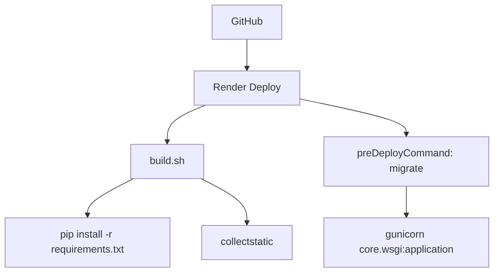

# Deploy, Storage e Infraestrutura

## Ambientes

O projeto roda em dois cenários principais:

- desenvolvimento local em Windows
- produção no Render

## Desenvolvimento Local

Ativar ambiente:

```powershell
Set-ExecutionPolicy -Scope Process -ExecutionPolicy RemoteSigned
.\venv\Scripts\Activate.ps1
```

Rodar aplicação:

```powershell
python manage.py migrate
python manage.py runserver
```

Quando o Django não estiver disponível no Python global:

```powershell
.\venv\Scripts\python.exe manage.py migrate
.\venv\Scripts\python.exe manage.py runserver
```

## Banco Local

Sem `DATABASE_URL`, o Django usa PostgreSQL local com variáveis:

- `DB_NAME`
- `DB_USER`
- `DB_PASSWORD`
- `DB_HOST`
- `DB_PORT`

Padrão esperado:

- host: `localhost`
- porta: `5432`
- banco: `axion_db`

## Produção no Render

Arquivos:

- `render.yaml`
- `build.sh`
- `runtime.txt`
- `requirements.txt`

Fluxo:



Variáveis principais no Render:

- `PYTHON_VERSION=3.12.8`
- `DEBUG=False`
- `DJANGO_SECRET_KEY`
- `ALLOWED_HOSTS=.onrender.com`
- `CSRF_TRUSTED_ORIGINS=https://*.onrender.com`
- `DATABASE_URL`

## Storage de Arquivos

O projeto usa `STORAGES` do Django.

### Local

Quando as variáveis de R2 não estão completas:

- `MEDIA_URL=/media/`
- `MEDIA_ROOT=media/`
- backend: `FileSystemStorage`

### Cloudflare R2

Quando as variáveis abaixo existem:

- `AWS_ACCESS_KEY_ID`
- `AWS_SECRET_ACCESS_KEY`
- `AWS_STORAGE_BUCKET_NAME`
- `AWS_S3_ENDPOINT_URL`

O storage padrão vira:

- backend: `storages.backends.s3.S3Storage`
- `file_overwrite=False`
- `querystring_auth=False`

Opcional:

- `AWS_S3_CUSTOM_DOMAIN`

## Render Free e Arquivos

No Render Free, arquivos salvos no disco da aplicação podem desaparecer em restart/deploy. Por isso, uploads importantes devem usar Cloudflare R2.

Áreas impactadas:

- certificados de padrões
- anexos de clientes
- anexos de propostas
- anexos de instrumentos
- documentos da qualidade

## Checklist de Deploy

Antes de subir:

```powershell
python manage.py check
python manage.py makemigrations --check --dry-run
python manage.py migrate
python manage.py collectstatic --noinput
```

Depois de subir:

- acessar login
- abrir dashboard
- testar cadastro simples
- testar upload
- testar PDF principal alterado
- testar usuário restrito quando houver alteração de permissão

## Problemas Comuns

### Erro 500 no Render

Verificar:

- migrations aplicadas
- `DATABASE_URL`
- `ALLOWED_HOSTS`
- `CSRF_TRUSTED_ORIGINS`
- `DJANGO_SECRET_KEY`
- storage R2
- logs do Render

### Upload salva, mas depois dá Not Found

Provável causa:

- arquivo foi salvo localmente no Render Free
- storage R2 não está ativo
- URL pública/domínio R2 não configurado

### PDF do R2 abre XML com erro Authorization

Provável causa:

- bucket/objeto não está público
- URL usada é endpoint S3 privado
- precisa habilitar URL pública, domínio público ou gerar URL assinada

## Segurança

- Nunca commitar `.env`.
- Nunca commitar chaves R2.
- `DEBUG` deve ser `False` em produção.
- Usar hosts permitidos restritos.
- Avaliar privacidade antes de tornar bucket público.
