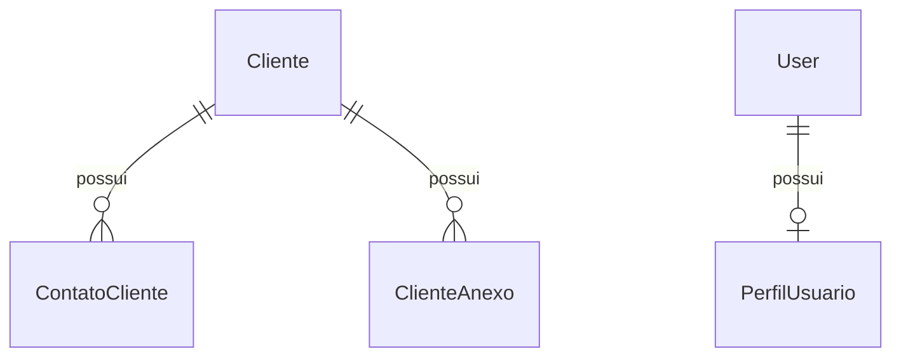
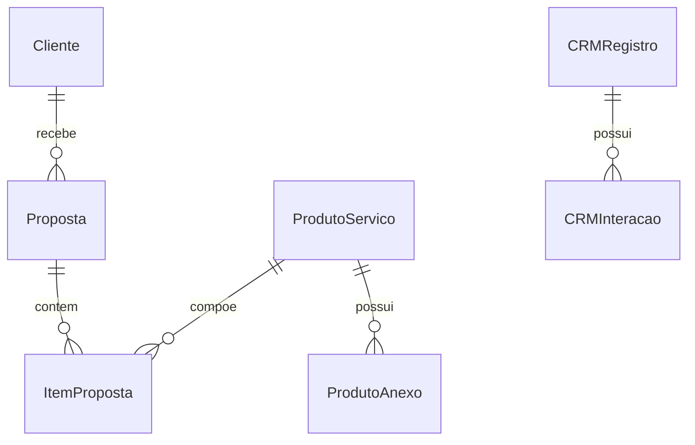
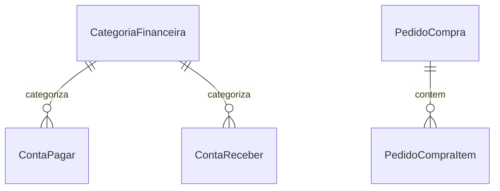
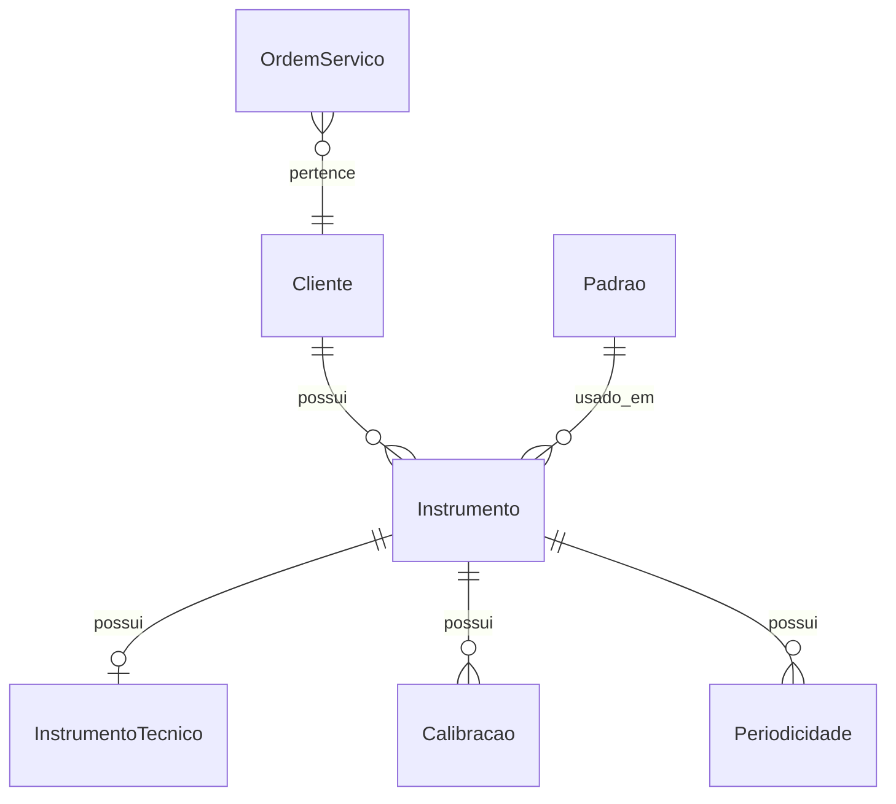
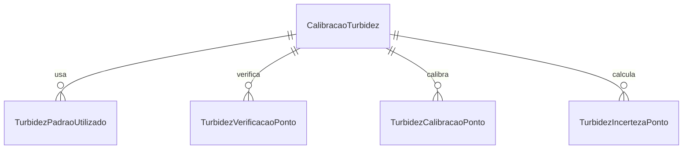
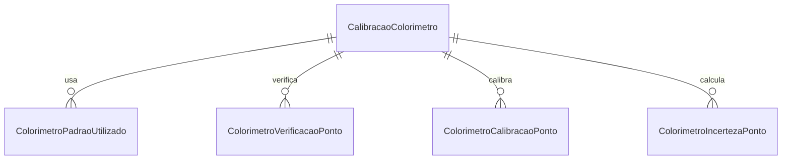
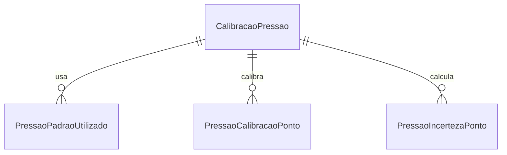
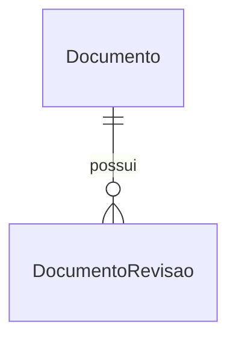
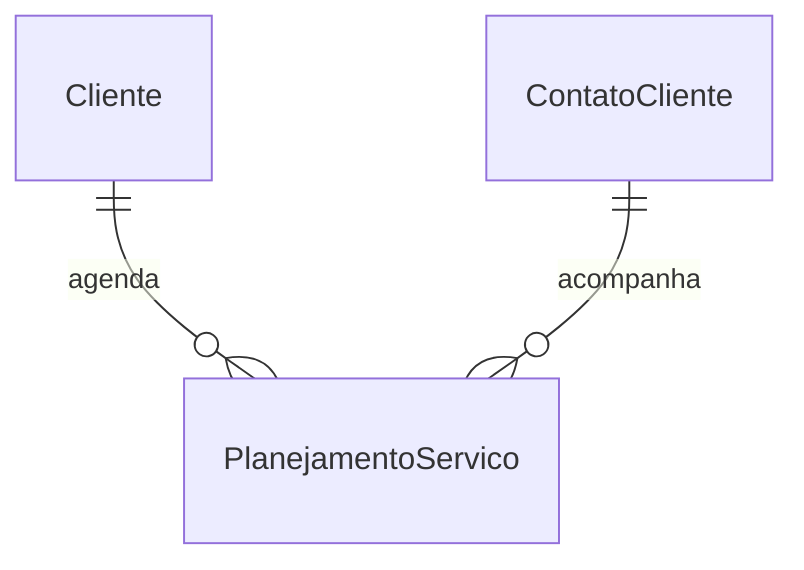

# Modelo de Dados

Este documento descreve os principais blocos de dados do sistema. Ele não substitui as migrations nem os models, mas serve como mapa de navegação.

## Clientes e Usuários

Entidades:

- `Cliente`: dados cadastrais, CNPJ, endereço e identificação comercial.
- `ContatoCliente`: contatos ligados a um cliente.
- `ClienteAnexo`: arquivos relacionados ao cliente.
- `PerfilUsuario`: define escopo de acesso por usuário.

## Comercial

Entidades:

- `ProdutoServico`: catálogo de serviços/produtos.
- `Proposta`: proposta comercial para cliente.
- `ItemProposta`: itens e valores da proposta.
- `CRMRegistro`: oportunidade ou registro comercial.
- `CRMTicket`: demandas de CRM.

## Financeiro

Entidades:

- `CategoriaFinanceira`: classificação financeira.
- `ContaPagar`: obrigações financeiras.
- `ContaReceber`: valores a receber.
- `Imposto`: impostos e competências.
- `PedidoCompra`: compra de fornecedor.
- `PedidoCompraItem`: itens do pedido.

## Metrologia Base

Entidades:

- `Instrumento`: equipamento do cliente.
- `InstrumentoTecnico`: dados técnicos do equipamento.
- `Padrao`: padrão metrológico com certificado, validade e incerteza.
- `OrdemServico`: OS ligada a cliente/proposta/equipamentos.
- `Calibracao`: calibração geral anterior às especializadas.

## Calibrações Especializadas

### Turbidez

### Colorímetro

### Pressão

Padrão comum:

- modelo principal guarda dados do certificado, cliente, instrumento e ambiente
- modelo de padrões guarda rastreabilidade
- modelo de pontos guarda leituras e resultado
- modelo de incerteza guarda cálculo metrológico

## Qualidade

Entidades:

- `Documento`: procedimento, método ou instrução controlada.
- `DocumentoRevisao`: histórico de revisões.

## Planejamento

Entidade:

- `PlanejamentoServico`: agenda serviço, visita, retirada, técnico, veículo, padrões e observações.

## Cuidados com Dados

- Usar `Decimal` para valores financeiros e metrológicos.
- Campos opcionais em inlines devem aceitar vazio sem quebrar o save.
- Evitar apagar dados vinculados a certificados já emitidos.
- Não alterar prefixos/códigos de certificados sem avaliar rastreabilidade.
- Migrations devem ser incrementais e preservadas.
