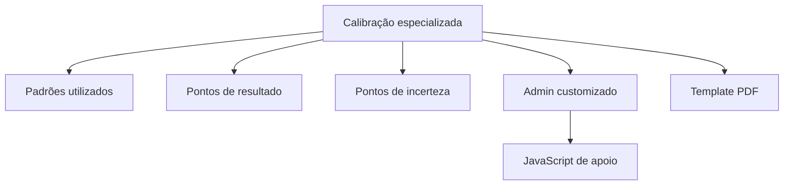

# Módulos do Sistema

## Core

Local: `core/`

Responsabilidades:

- configurações do Django
- URLs principais
- dashboard
- static/media
- autenticação pós-login
- templates globais do admin

Arquivos importantes:

- `core/settings.py`
- `core/urls.py`
- `core/views.py`
- `core/templates/dashboard.html`

## Clientes

Local: `clientes/`

Responsabilidades:

- cadastro de clientes
- contatos de clientes
- anexos
- perfis de usuário e restrição de acesso

Modelos principais:

- `Cliente`
- `ContatoCliente`
- `ClienteAnexo`
- `PerfilUsuario`

Pontos de atenção:

- cadastros podem usar autopreenchimento por CNPJ
- permissões impactam dashboard e menus
- alterações em perfil devem ser testadas com usuário restrito

## Comercial

Local: `comercial/`

Responsabilidades:

- produtos e serviços
- propostas comerciais
- itens de proposta
- CRM
- PDF de proposta

Modelos principais:

- `ProdutoServico`
- `Proposta`
- `ItemProposta`
- `CRMRegistro`
- `CRMTicket`

Pontos de atenção:

- proposta comercial possui layout profissional de impressão
- itens alimentam totais
- alterações devem preservar PDF e impressão A4

## Financeiro

Local: `financeiro/`

Responsabilidades:

- categorias financeiras
- contas a pagar
- contas a receber
- impostos
- pedidos de compra

Modelos principais:

- `CategoriaFinanceira`
- `ContaPagar`
- `ContaReceber`
- `Imposto`
- `PedidoCompra`
- `PedidoCompraItem`

Pontos de atenção:

- pedido de compra segue padrão visual da proposta
- totais devem usar `Decimal`
- integração com proposta/contas deve evitar duplicidade de valor

## Calibração

Local: `calibracao/`

Responsabilidades:

- instrumentos
- dados técnicos de instrumentos
- padrões
- ordens de serviço
- calibração geral
- calibrações especializadas
- certificados técnicos em PDF

Modelos base:

- `Instrumento`
- `InstrumentoTecnico`
- `OrdemServico`
- `Padrao`
- `Periodicidade`
- `Calibracao`
- `ResponsavelCertificado`

Calibrações especializadas:

- `CalibracaoTurbidez`
- `CalibracaoColorimetro`
- `CalibracaoPressao`

Padrão arquitetural de calibração especializada:

Pontos de atenção:

- não remover a calibração original
- novas calibrações devem ficar no grupo Gestão Metrológica
- sempre testar inlines com campos vazios
- PDFs não devem exibir cálculos internos desnecessários

## Qualidade

Local: `qualidade/`

Responsabilidades:

- documentos controlados
- revisões
- métodos/procedimentos utilizados em certificados

Modelos principais:

- `Documento`
- `DocumentoRevisao`

Pontos de atenção:

- certificados podem puxar número e revisão do documento
- documentos usados por calibração não devem ser removidos sem análise

## Planejamento

Local: `planejamento/`

Responsabilidades:

- planejamento de serviços
- calendário de serviços
- impressão de planejamento
- equipe técnica, veículo, cliente, padrões e observações

Modelo principal:

- `PlanejamentoServico`

Pontos de atenção:

- calendário deve facilitar visualização rápida
- impressão precisa caber em A4
- campos de assinatura do cliente precisam permanecer legíveis
