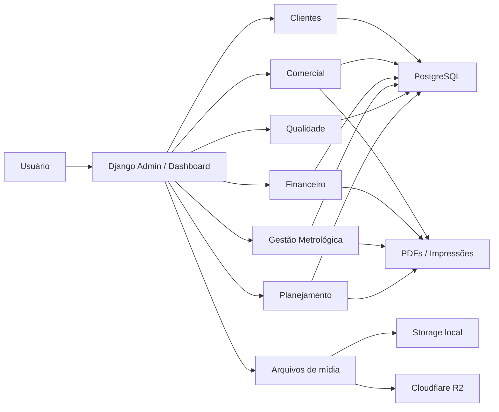

# Visão Geral da Arquitetura

## Contexto

O AXION é uma aplicação web interna para operação da DS Científica. A aplicação centraliza processos comerciais, financeiros, metrológicos, de qualidade e planejamento de serviços.

O sistema foi construído sobre Django e usa o Django Admin como principal interface de operação, com customizações visuais, templates próprios e recursos de impressão/PDF.

## Stack Técnica

- Linguagem: Python
- Framework: Django 6
- Banco: PostgreSQL
- Admin: Django Admin com customizações e Jazzmin
- Static files: WhiteNoise
- Storage de mídia: local em desenvolvimento ou Cloudflare R2 em produção
- Deploy: Render
- Servidor produção: Gunicorn
- PDFs: HTML/CSS renderizado pelo navegador ou views próprias

## Fluxo Geral da Aplicação

## Entradas Principais

- `/`: dashboard
- `/dashboard/`: dashboard
- `/admin/`: administração e operação principal
- `/calibracao/`: rotas auxiliares de calibração
- `/comercial/`: rotas auxiliares comerciais
- `/financeiro/`: rotas auxiliares financeiras

## Componentes Centrais

### Core

Responsável por configurações globais, URLs principais, dashboard, static/media e integração de ambiente.

### Django Admin

É a principal interface do sistema. Grande parte das funcionalidades é entregue por `ModelAdmin`, inlines, templates customizados e botões de ação.

### PDFs

Propostas, pedidos de compra, certificados e planejamentos possuem templates próprios. Esses documentos precisam ser tratados como saída oficial da empresa.

### Storage

Arquivos podem ficar em `media/` localmente. Em produção no Render, o armazenamento persistente deve usar Cloudflare R2 ou serviço equivalente.

## Cuidados Arquiteturais

- O projeto depende fortemente do admin; alterações de model devem validar formulários e inlines.
- Calibrações especializadas seguem um padrão repetido: model principal, padrões, pontos, incertezas, admin customizado e PDF.
- O Render Free não preserva arquivos locais; uploads precisam de storage externo.
- Documentos técnicos devem preservar rastreabilidade e apresentação profissional.
